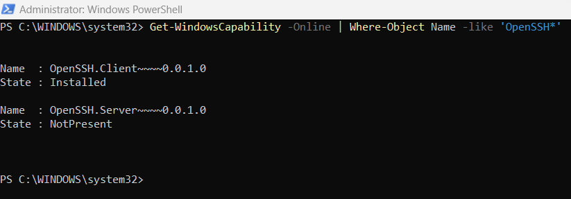
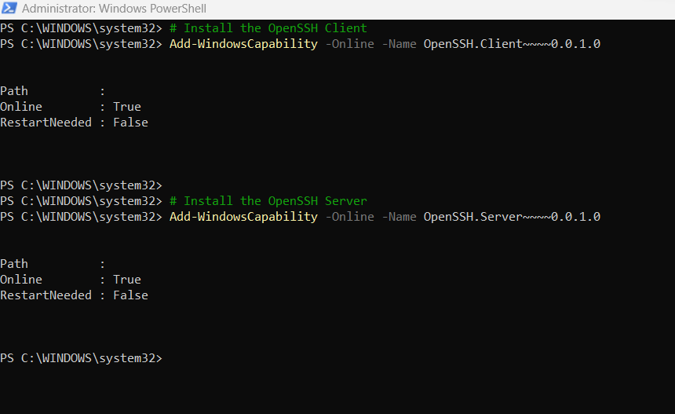

# Connect Linux server with ansible Via Widnows Jumphost

## Setting up OpenSSH on windows jumphost/baston host

### Prerequisites
Before you start, your computer must meet the following requirements:

1. A device running at least Windows Server 2019 or Windows 10 (build 1809).
2. PowerShell 5.1 or later.
3. An account that is a member of the built-in Administrators group.

### Prerequisites check
1. To validate your environmentif it met the pre-requisites, open an PowerShell session with Run as Administrator and do the following:

2. Type winver.exe and press enter to see the version details for your Windows device.


3. Run $PSVersionTable.PSVersion. Verify your major version is at least 5, and your minor version at least 1.


4. Run the command below. The output will show True when you're a member of the built-in Administrators group.

```
(New-Object Security.Principal.WindowsPrincipal([Security.Principal.WindowsIdentity]::GetCurrent())).IsInRole([Security.Principal.WindowsBuiltInRole]::Administrator)
```


### Install OpenSSH for Windows
1. To install OpenSSH using PowerShell, run PowerShell as an Administrator. To make sure that OpenSSH is available, run the following cmdlet:
```
Get-WindowsCapability -Online | Where-Object Name -like 'OpenSSH*'
```


2. Then, install the server or client components:
```
# Install the OpenSSH Client
Add-WindowsCapability -Online -Name OpenSSH.Client~~~~0.0.1.0

# Install the OpenSSH Server
Add-WindowsCapability -Online -Name OpenSSH.Server~~~~0.0.1.0
```



3. Both commands should return the following output:
```
Path          :
Online        : True
RestartNeeded : False
```

4. To start and configure OpenSSH Server for initial use, run the following commands to start the sshd service:
```
# Start the sshd service
Start-Service sshd
```
And also execute below command as well,(copy and paste the below commands on the powershell terminal. it will work)
```
# OPTIONAL but recommended:
Set-Service -Name sshd -StartupType 'Automatic'
```
```
# Confirm the Firewall rule is configured. It should be created automatically by setup. Run the following to verify
if (!(Get-NetFirewallRule -Name "OpenSSH-Server-In-TCP" -ErrorAction SilentlyContinue | Select-Object Name, Enabled)) {
    Write-Output "Firewall Rule 'OpenSSH-Server-In-TCP' does not exist, creating it..."
    New-NetFirewallRule -Name 'OpenSSH-Server-In-TCP' -DisplayName 'OpenSSH Server (sshd)' -Enabled True -Direction Inbound -Protocol TCP -Action Allow -LocalPort 22
} else {
    Write-Output "Firewall rule 'OpenSSH-Server-In-TCP' has been created and exists."
}
```

:congratulations: You have successfully setup OpenSSH server in windows machine.

# Configure ansible hosts file for connecting to private linux machine via public windows jumphost
### Prerequisites
1. Make sure you have ansible installed in your local machine from where you invoke ansible commands.
```
 ansible --version
```


2. Create the ansible inventory file with below content in it.
```
[deployment]
192.168.1.144 ansible_ssh_user=ec2-user ansible_ssh_private_key_file=~/Downloads/linux.pem


[deployment:vars]
ansible_ssh_common_args='-o StrictHostKeyChecking=no -o UserKnownHostsFile=/dev/null -o ProxyCommand="ssh -i ~/Downloads/windows-pem.pem -W %h:%p -q Administrator@35.175.136.54"'
```

> Here under [`deployment`] section,
* 192.168.1.144&emsp;&emsp;&emsp;&emsp;&emsp;&emsp;&emsp;-> This is my linux server ip address which resides in private subnet.
* ec2-user&emsp;&emsp;&emsp;&emsp;&emsp;&emsp;&emsp;&emsp;&emsp;-> This is my connect user for linux server.
* ~/Downloads/linux.pem&emsp;&emsp;-> This is my private key pem file for connecting linux server. pls make sure you have passed correct path where it resides and also make sure you have set read-only(400) permission to the pem file.

> Here under [`deployment:vars`] section,
* Administrator&emsp;&emsp;&emsp;&emsp;&emsp;&emsp;&emsp;&emsp;&emsp;&emsp;&emsp;-> This is my connect user for windows server.
* 35.175.136.54&emsp;&emsp;&emsp;&emsp;&emsp;&emsp;&emsp;&emsp;&emsp;&emsp;&emsp;-> This is my windows machine iip address which resides in public subnet.
* ~/Downloads/windows-pem.pem&emsp;&emsp; -> This is my private key pem file for connecting to windows server. If incase you downloaded ppk file for windows, makesure you convert it into pem file and use it. And also make sure you have set read-only(400) permissions to the pem file.

3. Create a sample ansible playbook with the below content,
```
---
  - name: Playbook
    hosts: deployment
    become: yes
    become_user: root
    tasks:
      - debug: msg="{{ ansible_hostname }}"
```
> **_NOTE:_** Here, `deployment` configured for `hosts` in the ansible playbook should match with the value in inventory file.

4. Execute the ansible playbook command,
```
ansible-playbook -i inventory sample-playbook.yml
```

If all the configuration mentioned above set properly, you should be able to see the hostname of Linux server in private subnet as a output of the above example playbook.